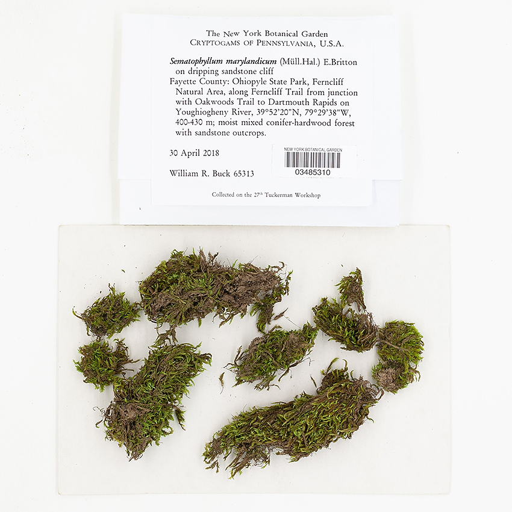

= Advancing the Catalogue of the World's Natural History Collections
:authorcount: 10
:author_1: Donald Hobern
:author_2: Alex Asase
:author_3: Quentin Groom
:author_4: Maofang Luo
:author_5: Deborah Paul
:author_6: Tim Robertson
:author_7: Patrick Semal
:author_8: Barbara Thiers
:author_9: Matt Woodburn
:author_10: Eliza Zschuschen
:toc: left
:toclevels: 3
:numbered:
:revnumber: {git-metadata-branch}
:revdate: {git-metadata-date}
:title-logo-image: 
:icons: font
:pagenums:
:license: https://creativecommons.org/licenses/by/4.0/
:xrefstyle: short
// Use original #_prefix_characters as the document has been published with these.
:idprefix: _
:idseparator: _
:scripts: cjk

ifdef::backend-html5[]
languageLinks:combined[]
endif::backend-html5[]

:sectnums!:

include::colophon.en.adoc[]

include::background.en.adoc[]

include::how-to.en.adoc[]

:sectnums:

include::100.en.adoc[]

include::200.en.adoc[]

include::300.en.adoc[]

include::400.en.adoc[]
